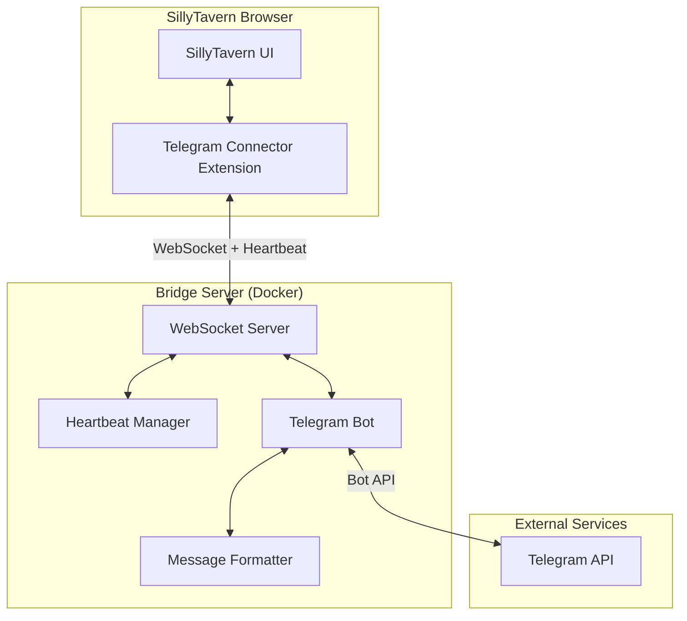
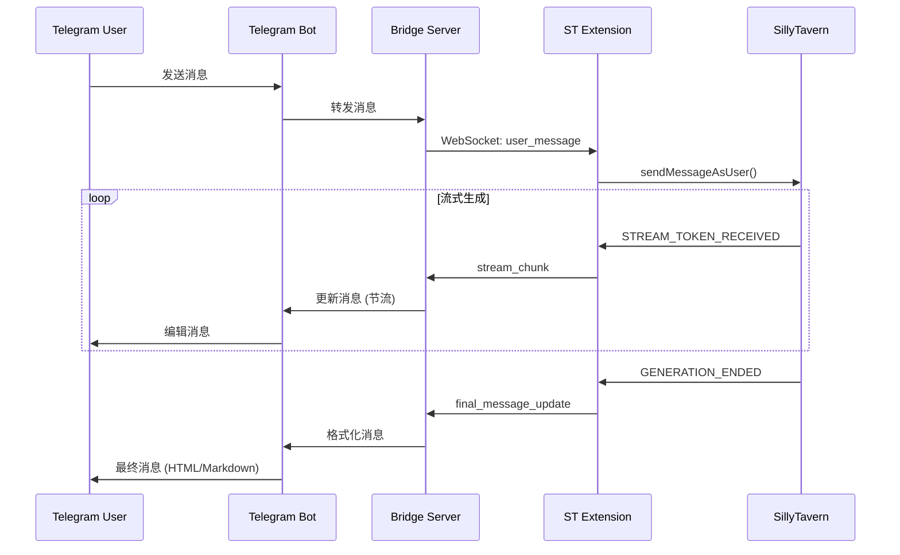

# Design Document

## Overview

本设计文档描述 SillyTavern Telegram Connector 项目增强功能的技术架构和实现方案。主要涵盖：
- WebSocket 心跳检测与自动重连
- Docker 容器化部署
- Telegram 流式输出优化
- 消息格式化渲染
- 前端消息处理优化

## Architecture

### 系统架构图



### 数据流图



## Components and Interfaces

### 1. Heartbeat Manager (新增组件)

**位置**: `server/server.js`

```javascript
// 接口定义
interface HeartbeatManager {
    startHeartbeat(ws: WebSocket): void;
    stopHeartbeat(ws: WebSocket): void;
    handlePong(ws: WebSocket): void;
}

// 消息格式
interface HeartbeatMessage {
    type: 'heartbeat' | 'heartbeat_ack';
    timestamp: number;
}
```

**实现策略**:
- 服务端每30秒发送 `heartbeat` 消息
- 客户端收到后回复 `heartbeat_ack`
- 服务端45秒未收到回复则标记连接为不健康

### 2. Message Formatter (新增组件)

**位置**: `server/messageFormatter.js`

```javascript
// 接口定义
interface MessageFormatter {
    format(text: string, mode: 'html' | 'markdown' | 'plain'): string;
    escapeHtml(text: string): string;
    escapeMarkdownV2(text: string): string;
}

// 配置接口
interface FormatterConfig {
    parseMode: 'HTML' | 'MarkdownV2' | null;
    enableCodeBlocks: boolean;
    enableBold: boolean;
    enableItalic: boolean;
}
```

**格式转换规则**:

| 源格式 | HTML 输出 | MarkdownV2 输出 |
|--------|-----------|-----------------|
| `**text**` | `<b>text</b>` | `*text*` |
| `*text*` | `<i>text</i>` | `_text_` |
| `` `code` `` | `<code>code</code>` | `` `code` `` |
| `\n` | `\n` | `\n` |

### 3. Connection Manager (扩展组件)

**位置**: `index.js`

```javascript
// 接口定义
interface ConnectionManager {
    connect(): void;
    disconnect(): void;
    reconnect(): void;
    handleHeartbeat(data: HeartbeatMessage): void;
}

// 重连配置
interface ReconnectConfig {
    maxRetries: number;      // 默认: 3
    retryDelay: number;      // 默认: 5000ms
    heartbeatTimeout: number; // 默认: 45000ms
}
```

### 4. Stream Session Manager (扩展组件)

**位置**: `server/server.js`

```javascript
// 会话结构
interface StreamSession {
    messagePromise: Promise<number>;
    lastText: string;
    timer: NodeJS.Timeout | null;
    isEditing: boolean;
    typingInterval: NodeJS.Timeout | null; // 新增: 持续typing状态
    charCount: number;                      // 新增: 字符计数
}
```

## Data Models

### 配置文件结构 (config.js)

```javascript
module.exports = {
    // Telegram 配置
    telegramToken: process.env.TELEGRAM_BOT_TOKEN || 'YOUR_TOKEN',
    
    // WebSocket 配置
    wssPort: parseInt(process.env.WSS_PORT) || 2333,
    
    // 白名单
    allowedUserIds: [],
    
    // 新增: 消息格式化配置
    messageFormat: {
        parseMode: 'HTML',  // 'HTML' | 'MarkdownV2' | null
        enableCodeBlocks: true,
        enableBold: true,
        enableItalic: true,
    },
    
    // 新增: 心跳配置
    heartbeat: {
        interval: 30000,    // 30秒
        timeout: 45000,     // 45秒
    },
    
    // 新增: 流式输出配置
    streaming: {
        minCharsBeforeDisplay: 50,  // 最小显示字符数
        updateInterval: 2000,        // 更新间隔(ms)
    },
};
```

### Docker 环境变量

| 变量名 | 描述 | 默认值 |
|--------|------|--------|
| `TELEGRAM_BOT_TOKEN` | Telegram Bot Token | 必填 |
| `WSS_PORT` | WebSocket 端口 | 2333 |
| `ALLOWED_USER_IDS` | 白名单用户ID (逗号分隔) | 空 |
| `MESSAGE_PARSE_MODE` | 消息格式 (HTML/MarkdownV2/plain) | HTML |
| `HEARTBEAT_INTERVAL` | 心跳间隔(ms) | 30000 |

## Error Handling

### 错误类型与处理策略

| 错误场景 | 处理策略 | 用户反馈 |
|----------|----------|----------|
| WebSocket 连接断开 | 自动重连(最多3次) | 状态栏显示"重连中..." |
| 心跳超时 | 标记断开，触发重连 | 状态栏显示"连接超时" |
| HTML 解析失败 | 回退到纯文本模式 | 无(静默处理) |
| 流式传输中断 | 清理会话，发送错误消息 | "消息生成中断" |
| Telegram API 限流 | 指数退避重试 | 无(静默重试) |

### 错误消息格式

```javascript
interface ErrorMessage {
    type: 'error_message';
    chatId: number;
    text: string;
    errorCode?: string;
    recoverable: boolean;
}
```

## Testing Strategy

### 单元测试

1. **MessageFormatter 测试**
   - HTML 转义测试
   - Markdown 转义测试
   - 格式转换正确性测试

2. **HeartbeatManager 测试**
   - 心跳发送间隔测试
   - 超时检测测试

### 集成测试

1. **WebSocket 连接测试**
   - 连接建立测试
   - 断开重连测试
   - 心跳机制测试

2. **流式输出测试**
   - 消息更新频率测试
   - 最终消息格式测试

### 手动测试场景

1. Docker 容器启动和配置
2. Telegram 消息格式渲染效果
3. 网络断开后的重连行为

## Docker 部署架构

### Dockerfile 设计

```dockerfile
FROM node:18-alpine
WORKDIR /app
COPY server/package*.json ./
RUN npm ci --only=production
COPY server/ ./
EXPOSE 2333
CMD ["node", "server.js"]
```

### docker-compose.yml 设计

```yaml
version: '3.8'
services:
  telegram-bridge:
    build: ./server
    ports:
      - "${WSS_PORT:-2333}:2333"
    environment:
      - TELEGRAM_BOT_TOKEN=${TELEGRAM_BOT_TOKEN}
      - WSS_PORT=2333
      - MESSAGE_PARSE_MODE=${MESSAGE_PARSE_MODE:-HTML}
    volumes:
      - ./server/config.js:/app/config.js:ro
    restart: unless-stopped
```

## 可选方案对比

### 消息格式化方案

| 方案 | 优点 | 缺点 | 推荐场景 |
|------|------|------|----------|
| **HTML** | 兼容性好，支持丰富格式 | 需要转义特殊字符 | 默认推荐 |
| **MarkdownV2** | 语法简洁 | 转义规则复杂，易出错 | 简单文本 |
| **纯文本** | 最稳定，无解析错误 | 无格式 | 兼容性优先 |

### 心跳实现方案

| 方案 | 描述 | 选择理由 |
|------|------|----------|
| **WebSocket ping/pong** | 使用 WS 协议内置机制 | 简单但不够灵活 |
| **应用层心跳** ✓ | 自定义心跳消息 | 可携带额外状态信息 |

### Docker 基础镜像选择

| 镜像 | 大小 | 选择理由 |
|------|------|----------|
| **node:18-alpine** ✓ | ~120MB | 体积小，安全性好 |
| node:18 | ~900MB | 功能完整但体积大 |
| node:18-slim | ~200MB | 折中方案 |
